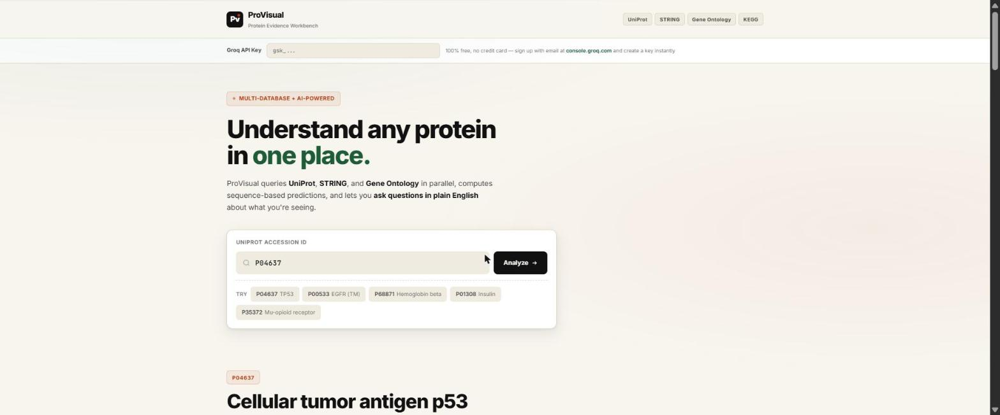
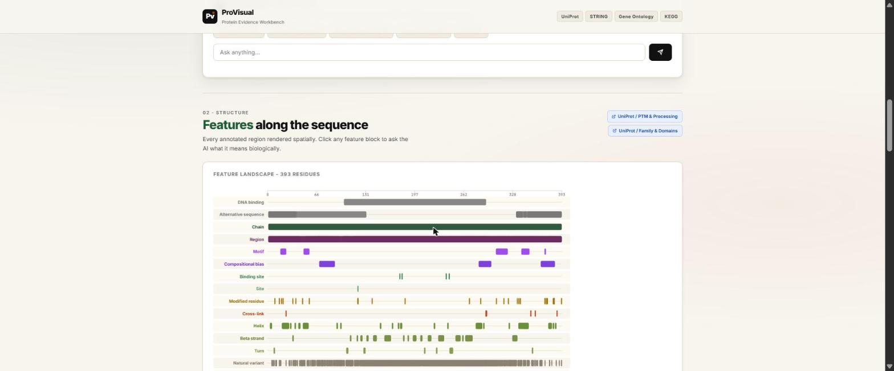
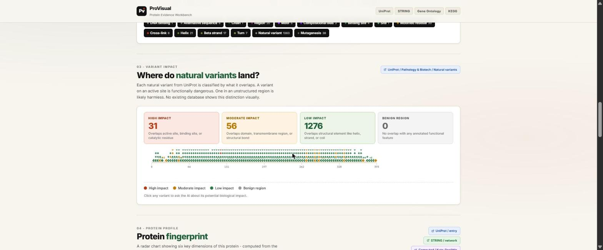

# ProVisual

**A protein evidence workbench that runs entirely in your browser.**

Enter a UniProt accession and ProVisual fans out parallel queries to UniProt, STRING, and Gene Ontology, computes sequence-based predictions locally, and renders the combined evidence as one annotated report — with an LLM assistant you can ask questions in plain English.

### [→ Open the live app](https://mk0b3.github.io/ProVisual/)

No install, no build step, no backend. One HTML file.



---

## Why

Answering a basic question about a protein — *what does it do, where does it sit, which variants actually matter* — normally means opening UniProt, STRING, QuickGO, and KEGG in separate tabs and mentally joining the results. Each database is excellent and none of them talk to each other.

ProVisual does that join for you, then adds the one thing none of the sources provide: a spatial view of how the evidence overlaps.

## What it does

**Every annotated region, rendered along the sequence.** Domains, motifs, binding sites, secondary structure, PTMs, and cross-links laid out on a shared coordinate system so you can see what overlaps what. Click any feature block to ask the assistant what it means biologically.



**Variant triage by structural context.** Each natural variant from UniProt is classified by what it lands on — active site, domain, structural element, or nothing annotated. A variant on a catalytic residue and a variant in a disordered loop are not the same thing, and this is the part no existing database shows visually.



**Sequence vs. annotation.** Kyte-Doolittle hydrophobicity is computed in-browser from the raw sequence, then compared against UniProt's curated transmembrane regions. Window size and threshold are live sliders, so you can watch the prediction move and see where computation and curation disagree.

**Plus:** a radar-chart protein fingerprint, the STRING interaction network, GO assignments split by MF/BP/CC, amino acid composition, and deep links back into every source.

## Run it

It's one self-contained file. Any of these work:

```bash
# Use the hosted version
open https://mk0b3.github.io/ProVisual/

# Or clone and open directly — no server needed
git clone https://github.com/MK0B3/ProVisual.git
cd ProVisual
start index.html        # Windows   (macOS: open index.html)
```

Try `P04637` (TP53), `P00533` (EGFR), `P68871` (hemoglobin beta), `P01308` (insulin), or `P35372` (mu-opioid receptor).

### Enabling the AI features

The summary and Q&A panels need a Groq API key. Everything else — all database queries, all visualizations, the hydrophobicity computation — works without one.

1. Get a free key at [console.groq.com/keys](https://console.groq.com/keys) (email signup, no credit card)
2. Paste it into the field at the top of the page

Your key is held in `sessionStorage` and sent only to Groq's API. It is never committed, logged, or transmitted anywhere else, and it clears when you close the tab.

## How it works

```
UniProt REST  ──┐
STRING API    ──┤──→  normalize  ──→  render 9 linked sections
Gene Ontology ──┘         │
                          ├──→  Kyte-Doolittle sliding window  →  TM prediction
                          └──→  Groq (Llama 3.3 70B)           →  summary + chat
```

| Layer | Choice |
|---|---|
| Frontend | Vanilla JS, no framework, no build |
| Charts | Hand-rolled inline SVG |
| Annotations | [UniProt REST](https://rest.uniprot.org/) |
| Interactions | [STRING](https://string-db.org/) (score ≥ 400, top 15) |
| Function | Gene Ontology, via UniProt cross-references |
| LLM | Groq — `llama-3.3-70b-versatile` |
| Hosting | GitHub Pages (static) |

Database calls are issued concurrently rather than in sequence, and a failed STRING lookup degrades gracefully instead of blocking the report.

## Limitations

- **TM prediction is a teaching implementation.** Plain Kyte-Doolittle with a fixed threshold, not a hidden Markov model. Because the sliding window pulls down the edges of each hydrophobic stretch, the default settings (window 19, threshold 1.60, minimum length 15) can miss genuine helices — EGFR's annotated 646–668 region clears the threshold for only 13 smoothed residues and is discarded. Widen the threshold slider to recover it, and use DeepTMHMM or Phobius for anything real.
- **Variant impact classification is positional**, based on overlap with annotated features. It is not a pathogenicity predictor and should not be read as one.
- The STRING network needs a gene name; entries without one skip that section.
- Rate limits are the public ones for each API. Heavy use may throttle.

## Authors

Built by **Ali Wazni** and **Mohammad Kobeissi**
CMPS 297AF — American University of Beirut, Spring 2026

## License

[MIT](LICENSE)

Data belongs to its providers: UniProt ([CC BY 4.0](https://www.uniprot.org/help/license)), STRING ([CC BY 4.0](https://string-db.org/cgi/access)), and the Gene Ontology Consortium ([CC BY 4.0](http://geneontology.org/docs/go-citation-policy/)). Please cite them, not this tool.
